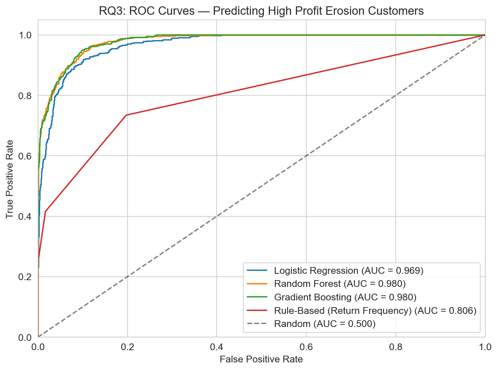
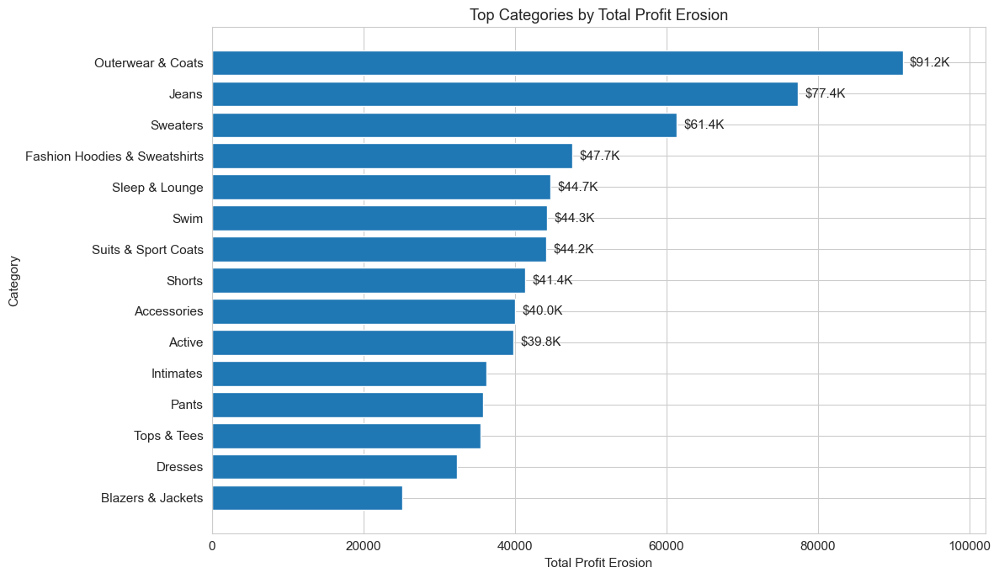
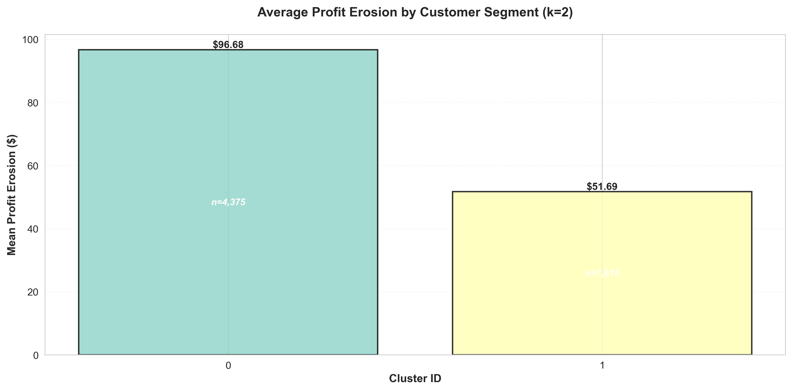
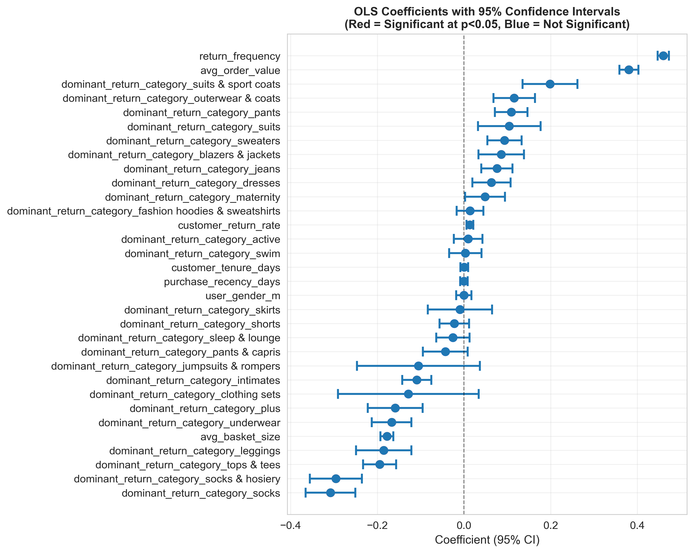

# Analyzing Profit Erosion from Product Returns in E-Commerce
### A Multi-Method Analytics Framework

[](https://github.com/kojounfc/unfc-capstone-project-1/actions/workflows/ci.yml)


[](https://profiterosionfromreturns.streamlit.app)

**Course**: DAMO-699-4 Capstone Project — Winter 2026
**Institution**: University of Niagara Falls Canada

---



> *ROC curves for all four models (Random Forest champion AUC = 0.9798). All exceed the operational threshold of 0.70.*

---

## Problem Statement

Product returns are economic reversal events that directly erode realized revenue and margin. This project reframes returns beyond operational metrics to quantify:

- **Margin reversal**: the margin lost on returned items (`sale_price - cost`)
- **Incremental processing costs**: customer service, inspection, restocking, and logistics (`$12` base per return, category-tier adjusted)

> **Core formula:** `Profit Erosion = Margin Reversal + Processing Cost`

---

## Research Questions

| RQ | Focus | Method |
|----|-------|--------|
| **RQ1** | Profit erosion differences across product categories and brands | Descriptive analysis + Kruskal-Wallis |
| **RQ2** | Customer behavioral segments with differential profit erosion | K-Means clustering + Gini/Lorenz/Pareto |
| **RQ3** | Predict high-erosion customers (target AUC > 0.70) | ML classification (RF, GB, LR) + rule-based baseline + ablation |
| **RQ4** | Marginal associations between behaviors and profit erosion | Log-linear OLS regression |

---

## Key Findings

### RQ1 — Profit erosion differs significantly across product categories and brands

- Kruskal-Wallis test: **p = 2.63 × 10⁻³³**, effect size ε² = 0.454 (large) — H₀ rejected
- Top erosion categories: **Outerwear & Coats** (~$2.0K), **Sweaters** (~$1.6K), **Jeans** (~$1.4K)
- Brand-level test also significant: p = 1.08 × 10⁻⁴, ε² = 0.442 — structured, higher-margin apparel drives disproportionate financial loss
- SSL directional validation: category-level differences replicated on external B2B dataset (p ≈ 0.00)



---

### RQ2 — Profit erosion is moderately concentrated and customers cluster into distinct behavioral segments

- **11,988** customers with returns across 79,944 total; total profit erosion = **$816,501**
- Gini coefficient = **0.409** — top 20% of customers account for **47.6%** of total erosion
- K-Means (k = 2) identifies two behaviorally distinct segments; Kruskal-Wallis p ≈ 0.00, η² = 0.130
- High-risk cluster (n = 4,375): mean erosion **$96.68** vs low-risk cluster — H₀ rejected
- SSL pattern validation: 60% feature agreement rate across 10 behavioral features



---

### RQ3 — High-erosion customers are predictable with high accuracy from behavioral features alone

- All four models exceed the AUC > 0.70 operational threshold — **H₀ rejected**
- Champion model (Random Forest): **Test AUC = 0.9798**, F1 = 0.8419, Recall = 0.9115
- 7 of 12 candidate features survive 2-gate screening; `return_frequency` is the strongest predictor (r = 0.614)
- Rule-based baseline (return_frequency threshold only): AUC = 0.8055 — ML adds meaningful lift beyond a simple rule
- Ablation study: removing top-3 features causes only **0.001 AUC drop** — model is robust, not dominated by a single predictor
- SSL external validation: directional accuracy = **76.4%**, Spearman ρ = **0.7526** (p ≈ 0.00)

| Model | CV AUC | Test AUC | F1 | Precision | Recall |
|-------|--------|----------|----|-----------|--------|
| **Random Forest** ★ | 0.9792 | **0.9798** | 0.8419 | 0.7822 | 0.9115 |
| Gradient Boosting | 0.9797 | 0.9795 | 0.8484 | 0.7801 | 0.9299 |
| Logistic Regression | 0.9646 | 0.9687 | 0.8256 | 0.7591 | 0.9048 |
| Rule-Based (return_frequency) | N/A | 0.8055 | 0.6313 | 0.5535 | 0.7346 |

---

### RQ4 — Return frequency and order value are the primary behavioral drivers of profit erosion magnitude

- Log-linear OLS on 11,694 customers with ≥1 return; **R² = 0.7188** (explains 71.9% of log-erosion variance)
- `return_frequency`: **+0.460** coefficient (+58% erosion per additional return) — strongest behavioral predictor
- `avg_order_value`: **+0.380** coefficient (+46% erosion per unit increase)
- `avg_basket_size`: **−0.178** (more items per order slightly reduces per-item erosion)
- Category dummies significant: Suits, Outerwear, Jeans → positive; Socks, Underwear, Tops & Tees → negative
- SSL validation: R² = 0.6185 (ratio 0.86); `return_frequency` direction consistent across both datasets



---

## Data Sources

**Primary**: `bigquery-public-data.thelook_ecommerce` (Google BigQuery)

| Table | Description |
|-------|-------------|
| `order_items` | Item-level transactions |
| `orders` | Order-level information |
| `products` | Product catalog with cost and pricing |
| `users` | Customer demographics and acquisition |

**External Validation**: School Specialty LLC (SSL) — U.S. educational supplies B2B retailer

- `data/raw/SSL_Returns_df_yoy.csv` (~234K return order lines, 2024–2025; not tracked in repo)
- Used for directional validation of RQ1, RQ2, RQ3, and RQ4 outputs

---

## Repository Structure

```text
unfc-capstone-project/
|-- app/                        # Streamlit dashboard (static — reads from reports/ and figures/)
|   |-- Home.py
|   `-- pages/
|       |-- 0_EDA.py
|       |-- 1_RQ1_Category_Analysis.py
|       |-- 2_RQ2_Customer_Segments.py
|       |-- 3_RQ3_Predictive_Model.py
|       `-- 4_RQ4_Behavioral_Associations.py
|-- data/
|   |-- raw/                    # Source CSVs (not tracked)
|   `-- processed/              # Processed parquet/CSV files (tracked)
|       |-- rq1/
|       |-- rq1_ssl/
|       |-- rq2/
|       |-- rq3/
|       `-- rq4/
|-- figures/
|   |-- eda/
|   |-- rq1/
|   |-- rq1_ssl/
|   |-- rq2/
|   |-- rq2_ssl/
|   |-- rq3/
|   `-- rq4/
|-- reports/
|   |-- rq1/
|   |-- rq1_ssl/
|   |-- rq2/
|   |-- rq3/
|   `-- rq4/
|-- notebooks/
|   `-- profit_erosion_analysis.ipynb   # Master notebook: full pipeline (sections 1–10)
|-- src/                        # Python modules (flat structure — no sub-packages)
|   |-- config.py
|   |-- data_processing.py
|   |-- data_cleaning.py
|   |-- feature_engineering.py
|   |-- model_ready_views.py
|   |-- analytics.py
|   |-- visualization.py
|   |-- descriptive_transformations.py
|   |-- rq1_run.py
|   |-- rq1_stats.py
|   |-- rq1_ssl_preprocessing.py
|   |-- rq1_ssl_validation.py
|   |-- rq2_run.py
|   |-- rq2_segmentation.py
|   |-- rq2_concentration.py
|   |-- rq3_modeling.py
|   |-- rq3_sensitivity.py
|   |-- rq3_visuals.py
|   |-- rq3_validation.py
|   |-- rq4_econometrics.py
|   |-- rq4_validation.py
|   |-- rq4_ssl_validation.py
|   `-- rq4_visuals.py
|-- tests/                      # pytest unit tests (512 tests)
|-- docs/                       # Technical documentation per RQ
|-- pytest.ini
`-- requirements.txt
```

---

## Master Notebook

`notebooks/profit_erosion_analysis.ipynb` is the **single source of truth** for the full analytics pipeline. Run cells top-to-bottom to regenerate all artifacts.

| Section | Content |
|---------|---------|
| 1–4 | Setup, data loading, cleaning, feature engineering |
| 5 | Group-level descriptive transformations |
| 6 | RQ1: Category and brand statistical analysis |
| 7 | RQ2: Customer segmentation (K-Means, concentration analysis) |
| 8 | RQ3: Predictive modeling — feature screening → training → evaluation → rule-based baseline → ablation |
| 8B | RQ3: SSL external validation |
| 9 | RQ4: Log-linear OLS regression + SSL validation |
| 10 | Summary and conclusions |

**Artifact output discipline:**

- Parquet and model-ready datasets → `data/processed/<rq>/`
- CSV report artifacts → `reports/<rq>/`
- Figures → `figures/<rq>/`

---

## Cost Model

**Base cost:** `$12.00` per return

| Component | Amount |
|-----------|--------|
| Customer Care | $4.00 |
| Inspection | $2.50 |
| Restocking | $3.00 |
| Logistics | $2.50 |

| Tier | Multiplier | Effective Cost | Categories |
|------|------------|----------------|------------|
| Premium | 1.3× | $15.60 | Outerwear, Jeans, Suits, Dresses, Sweaters |
| Moderate | 1.15× | $13.80 | Active, Swim, Accessories, Sleep and Lounge |
| Standard | 1.0× | $12.00 | Tops and Tees, Intimates, Socks, Underwear |

---

## Getting Started

### Prerequisites

- Python 3.11+
- Git

### Setup

```bash
git clone https://github.com/kojounfc/unfc-capstone-project-1.git
cd unfc-capstone-project-1

python -m venv venv
# Windows:
venv\Scripts\activate
# macOS/Linux:
source venv/bin/activate

pip install -r requirements.txt
```

### Run the master notebook

```bash
jupyter notebook notebooks/profit_erosion_analysis.ipynb
```

Run cells top-to-bottom. All artifacts are written to `data/processed/`, `reports/`, and `figures/`.

### Run tests

```bash
pytest tests/ -v
```

> **Note**: RQ4 tests require `statsmodels`. If using the project venv, install it with `pip install statsmodels`, or run tests via the Conda `python311` environment.

### Launch the dashboard

```bash
cd app
pip install -r requirements.txt
streamlit run Home.py
```

The dashboard reads pre-generated artifacts from `reports/` and `figures/` — no live model re-run required. Opens at `http://localhost:8501`.

> **Live deployment**: [profiterosionfromreturns.streamlit.app](https://profiterosionfromreturns.streamlit.app)

---

## Continuous Integration

GitHub Actions runs the full pytest suite on pull requests to `main` and `dev`. All **512 tests** pass.

---

## Team

| Name | Student ID | Primary RQ |
|------|------------|------------|
| Mario Zamudio | NF1002499 | RQ4 |
| Joseph Kojo Foli | NF1007842 | RQ3, RQ4 |
| Avinash Brandon Maharaj | NF1002706 | RQ2 |
| Roberto San Miguel | NF1001332 | RQ1 |

---

*Data: `bigquery-public-data.thelook_ecommerce` · External validation: School Specialty LLC (SSL) 2024–2025*
*Academic use only — University of Niagara Falls Canada*
